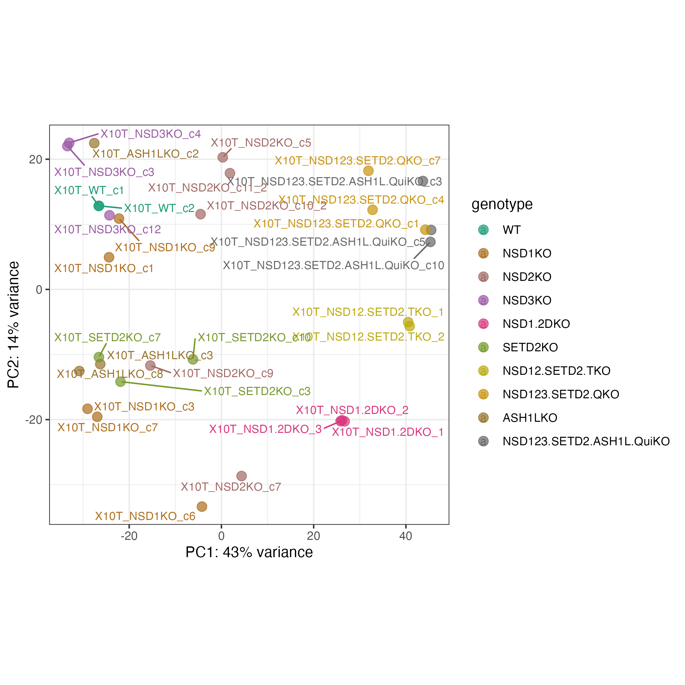
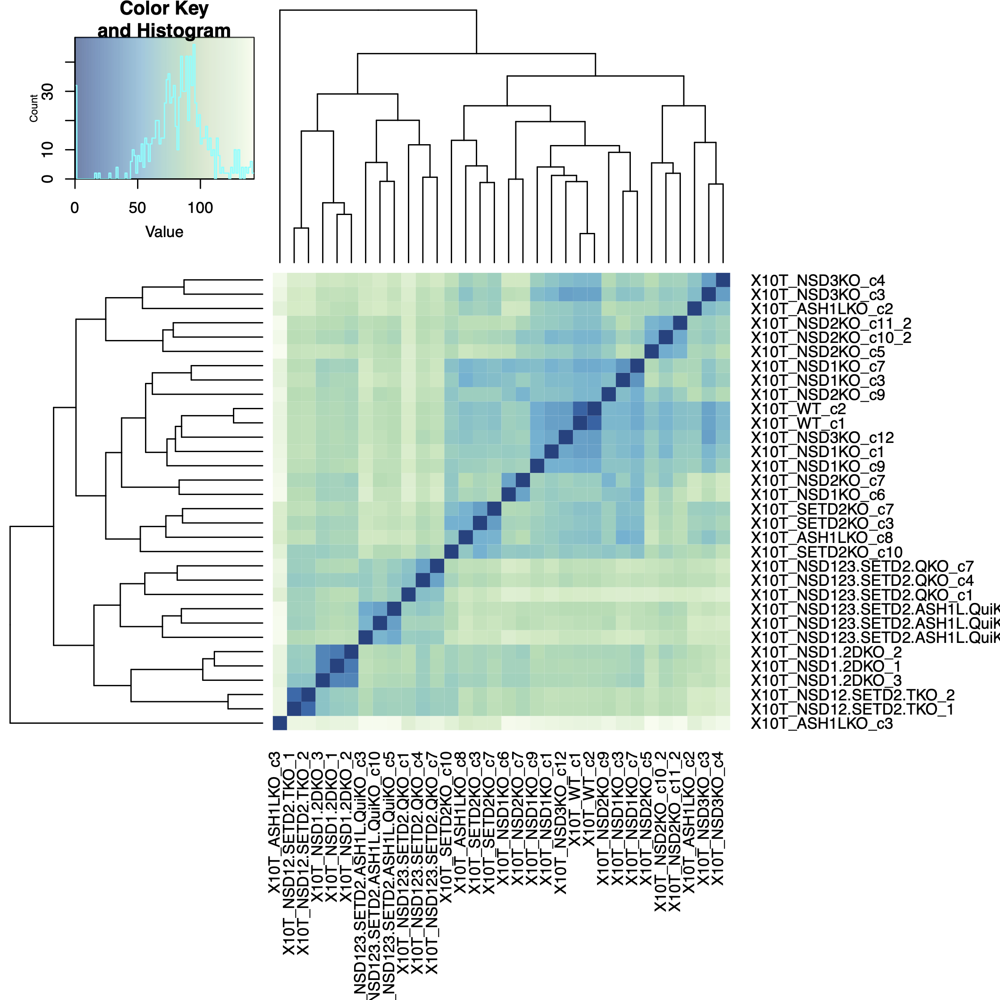

+++
title = '10T RNA-Seq new batch'
date = 2024-02-08T12:01:11-05:00
draft = false
description = " "
tags = ["10T","RNA-seq"]
projects = ["pericentromeric satellites"]
+++

# 10T RNA-seq data analysis
- raw data path: `/project/6007495/shareroot/projects/cell_lines/10Ts/RNAseq/local`
## 1. Alignemnt-based quantification
## 1.1 Methods and tools
- aligner: STAR
- quantificaiton: TEcount from TEtranscript
- reference: mm39, mm39.gencode.vM33.annotation.gtf, repeatmasker track from https://labshare.cshl.edu/shares/mhammelllab/www-data/TEtranscripts/TE_GTF/
## 1.2 DE analysis
- genes/TEs with raw count <= 10 in half of the smaples were filtered
- contrast design: `~genotype` KOs vs WT
### 1.2.1 Sample clustering

### 1.2.2 Volcano plots of all genes/TEs/Sats

### 1.2.3 Volcano plots of TEs/Sats only
    