+++
title = 'Cal27 RNASeq'
date = 2024-02-02T15:01:42-05:00
draft = false
description = " "
tags = ["cal27","RNA-seq"]
projects = ["pericentromeric satellites"]
+++

# Ca27 RNA-seq data analysis
## 1. Alignemnt-based quantification
## 1.1 Methods and tools
- aligner: STAR
- quantificaiton: TEcount from TEtranscript
- reference: T2T-CHM13.v2, chm13.draft_v2.0.gene_annotation, repeatmasker track from https://labshare.cshl.edu/shares/mhammelllab/www-data/TEtranscripts/TE_GTF/
## 1.2 DE analysis
- genes/TEs with raw count <= 10 in half of the smaples were filtered
- contrast design: `~genotype` KOs vs WT
### 1.2.1 Sample clustering
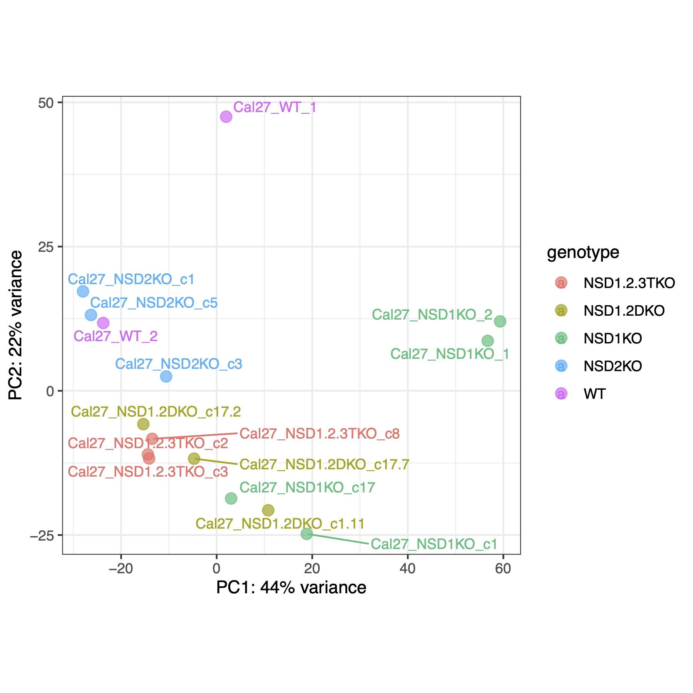
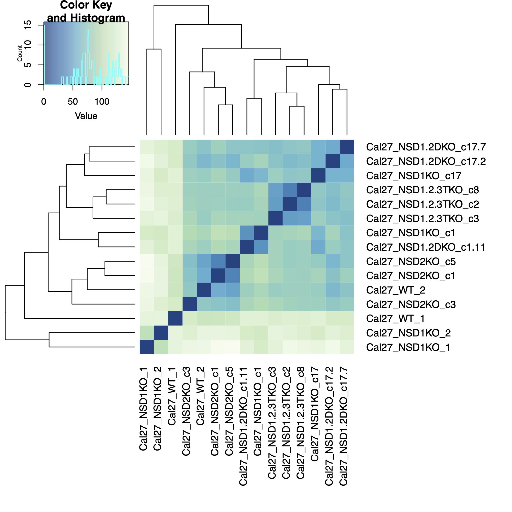
### 1.2.2 Volcano plots of all genes/TEs/Sats
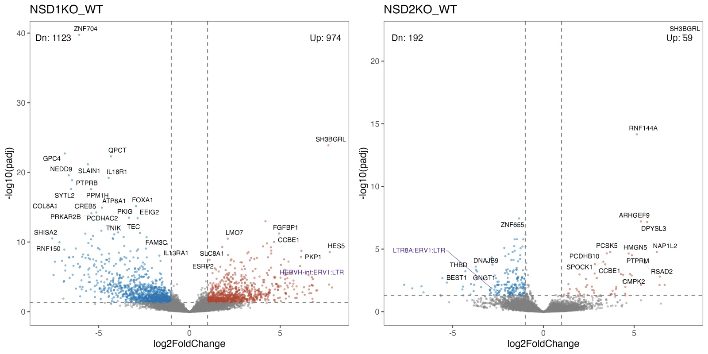
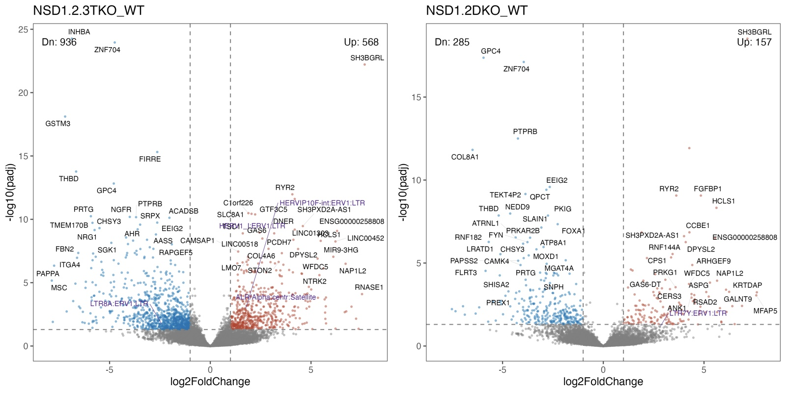
### 1.2.3 Volcano plots of TEs/Sats only
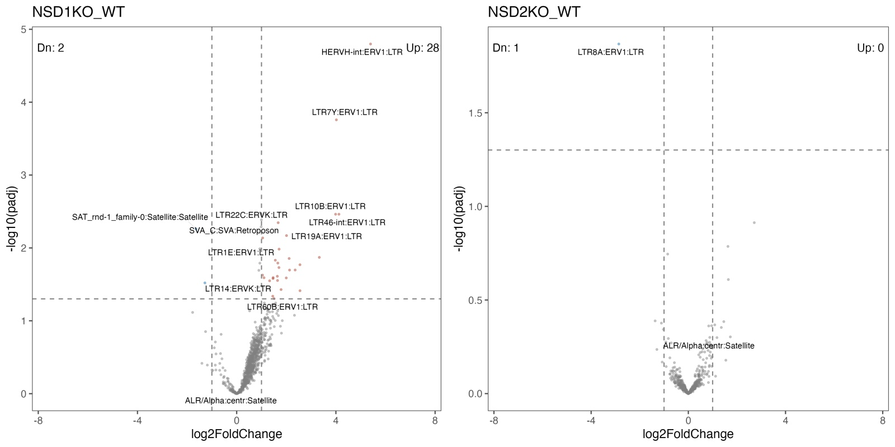
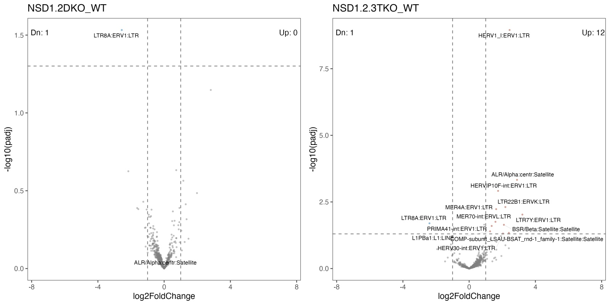

### 1.2.4 Normalized counts
- median of ratios, between samples
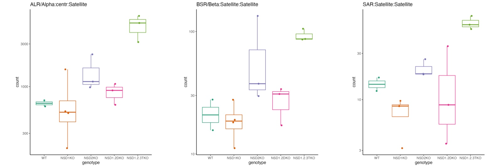
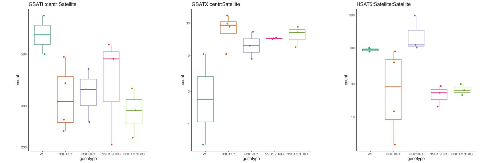
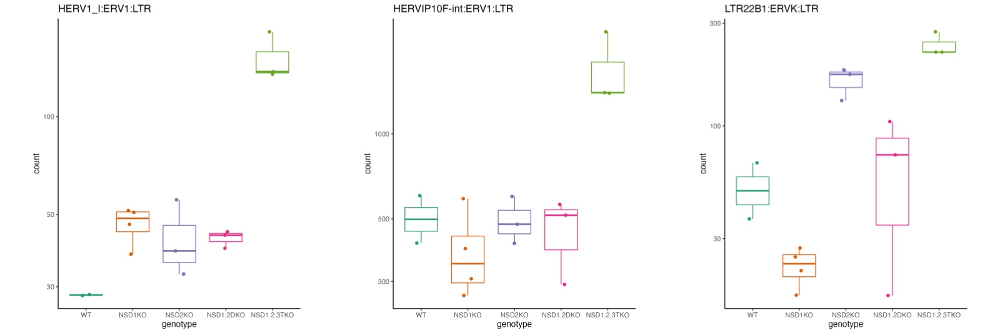
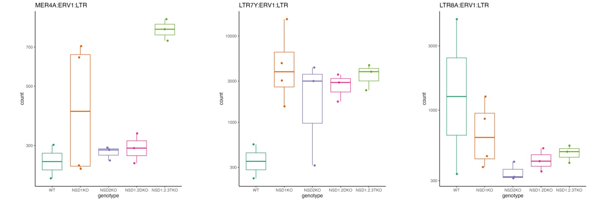
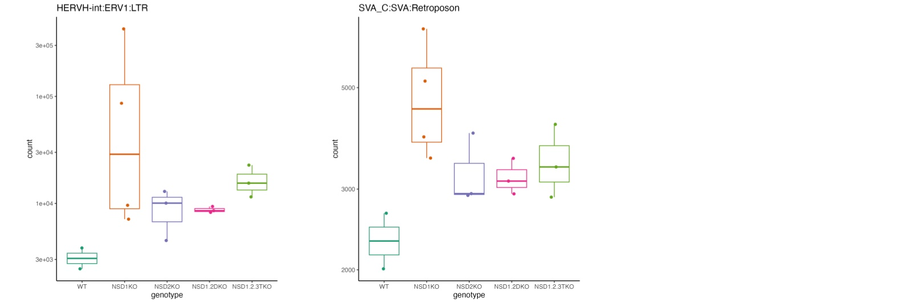

