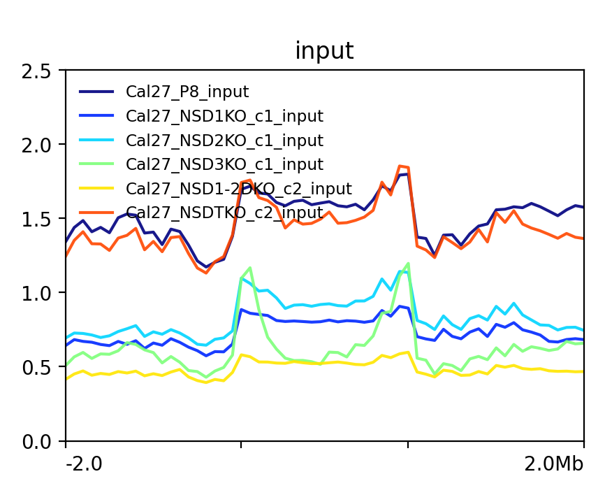
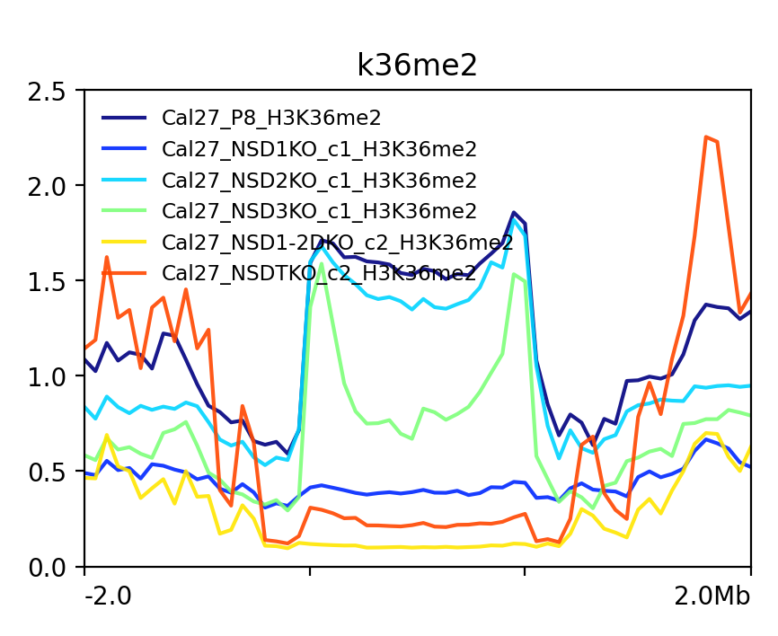
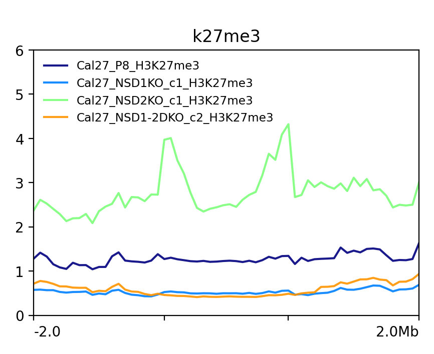
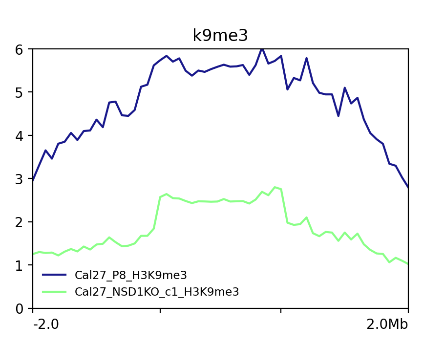
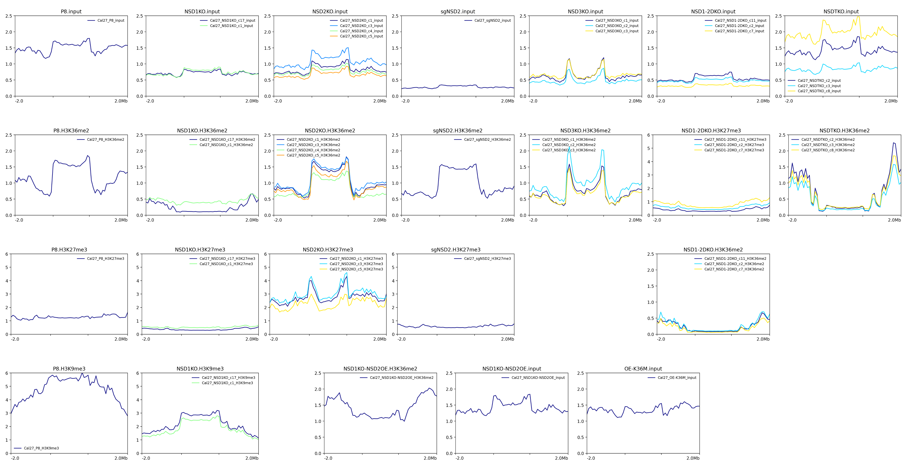

+++
title = 'Human Alpha Satellite'
date = 2024-01-15T11:45:42-05:00
draft = false
description = " "
tags = [
    "ChIP-seq",
    "satellite repeat",
    "cal27",
]
projects = ["pericentromeric satellites"]
+++

## Cell type/line
Head and neck cancer epithelial cells, Cal27.

## Method
- `deeptools ComptueMatrix` profiling
- Only kept active HOR; one per chromosome
- More consistent in length
- Most of them > 1.0 mb except the one on chr21
- Body length: 2.0 mb
- Flanking: 2.0 mb each side

## Input and histone marks
### Seletced samples

### All samples

## IGV screenshot for chr8

