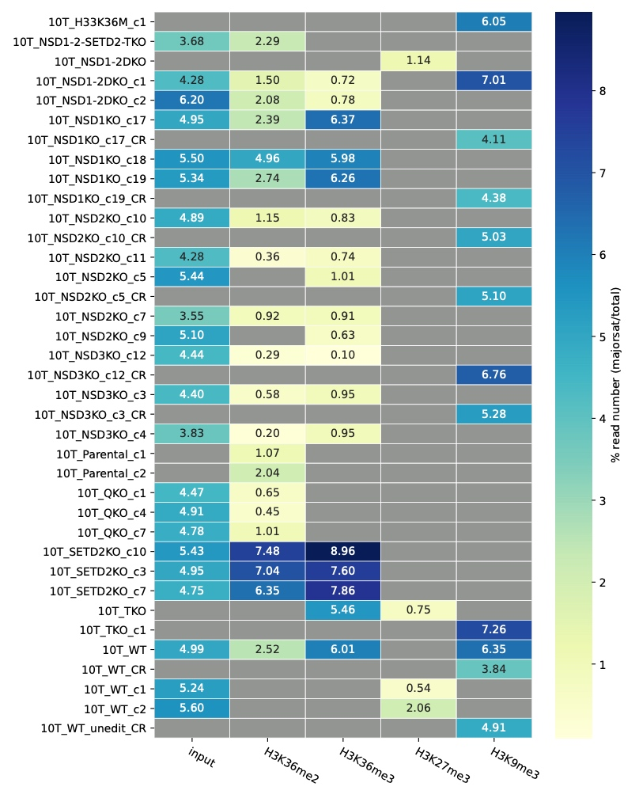
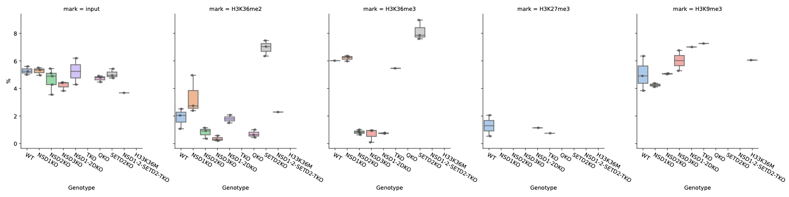
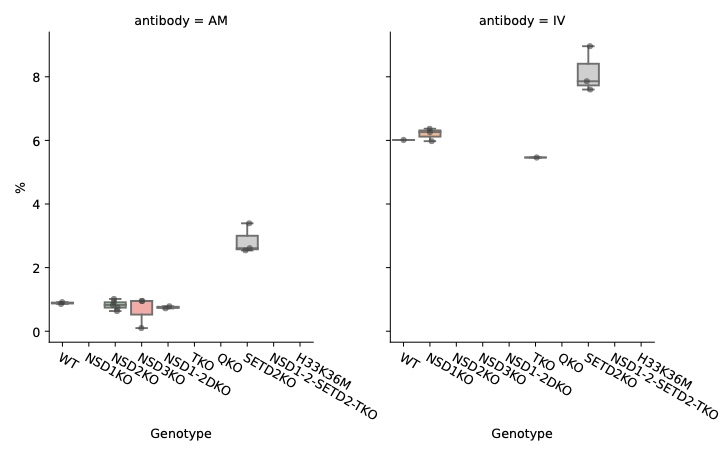

+++
title = 'Mouse Major Satellite'
date = 2024-01-15T11:45:52-05:00
draft = false
tags = [
    "ChIP-seq",
    "satellite repeat",
    "10T",
]
projects = ["pericentromeric satellites"]
description = " "
+++

## Cell type/line
Mouse embryo fibroblast, C3H/10T1/2 (10T).

## Method
- Since there are still gaps in mm39 reference 
- Extract sequence-specific reads from fastq files using `seqkit`, avoiding mapping (may also make it easy to compare ChIP-seq and cut&run …?)
- “satellite-specific” sequence from Pailles et al. 2022[^1].
    > “GACGACTTGAAAAATGACGAAATC|CATATTCCAGGTCCTTCAGTGTGC|GAAAAAGGTGGAAAATTTAGA|AGAAAACTGAAAATCATGGAAAAT|GATTTCGTCATTTTTCAAGTCGTC|GCACACTGAAGGACCTGGAATATG|TCTAAATTTTCCACCTTTTTC|ATTTTCCATGATTTTCAGTTTTCT” 

## Heatmap

## Boxplot

### Split H3K36m3 samples by antibodies
- AM: Active Motif, cross-react with H3K36me2
- IV: Invitrogen, cross-react with H3K9me3

## Ref.
[^1]: Pailles, Mélanie, Mélanie Hirlemann, Vincent Brochard, Martine Chebrout, Jean-François Oudin, Hendrik Marks, Alice Jouneau, and Amélie Bonnet-Garnier. 2022. “H3K27me3 at Pericentromeric Heterochromatin Is a Defining Feature of the Early Mouse Blastocyst.” Scientific Reports 12 (1): 13908. https://doi.org/10.1038/s41598-022-17730-x.
